Vistas de la plataforma web

# Integracion y Derivacion de Metodos Numericos

### Interfaz Portada Ordenador
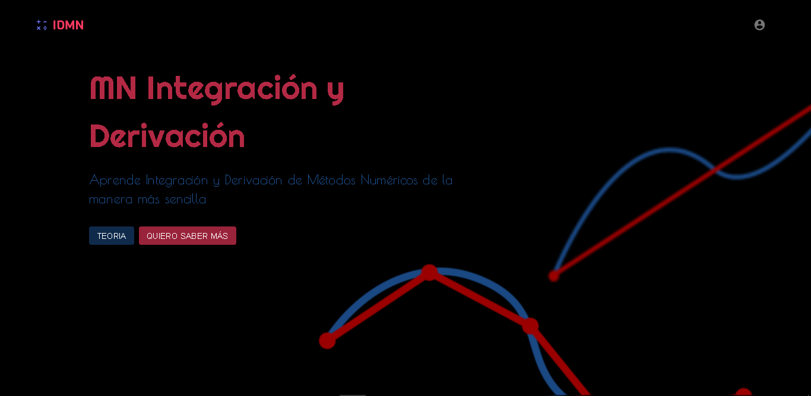

### Interfaz Portada Responsive
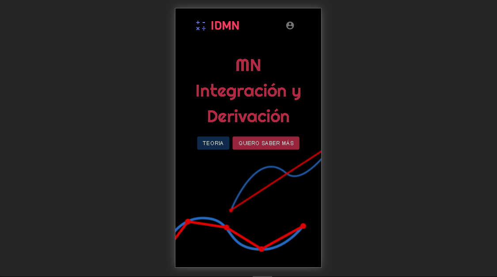

### Interfaz Inicial Ordenador
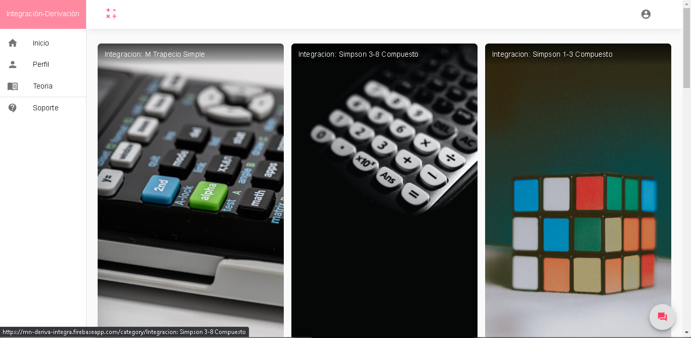

### Interfaz Inicial Responsive
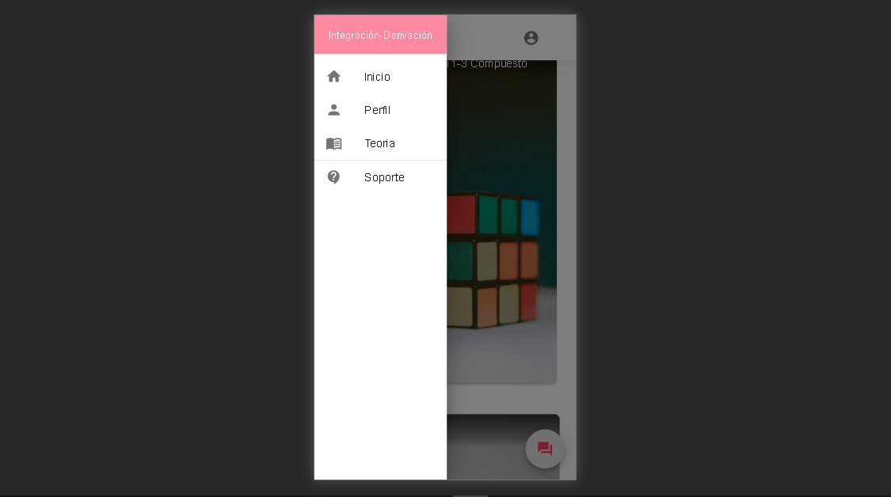

### Interfaz Inicial Responsive
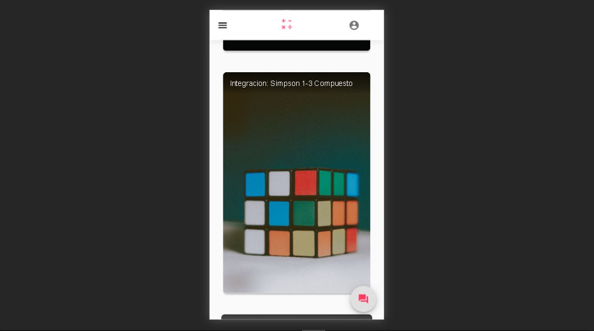

### Interfaz Contenido Metodo Ordenador
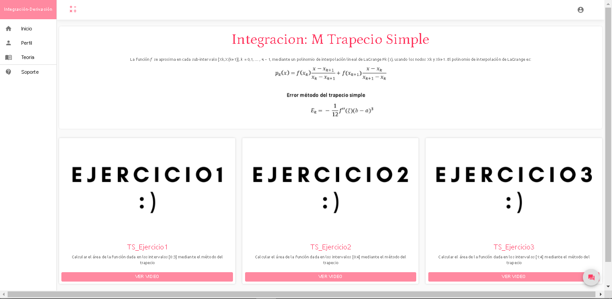

### Interfaz Contenido Metodo Responsive
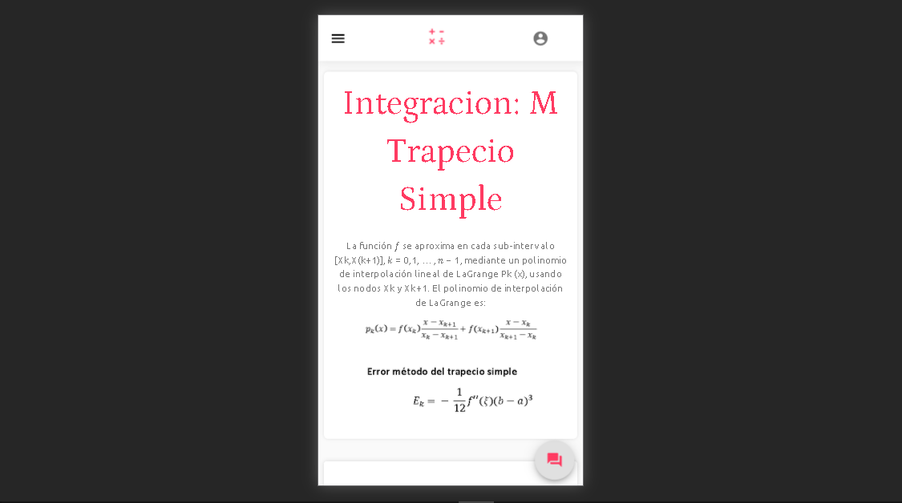

### Interfaz Contenido Metodo Responsive
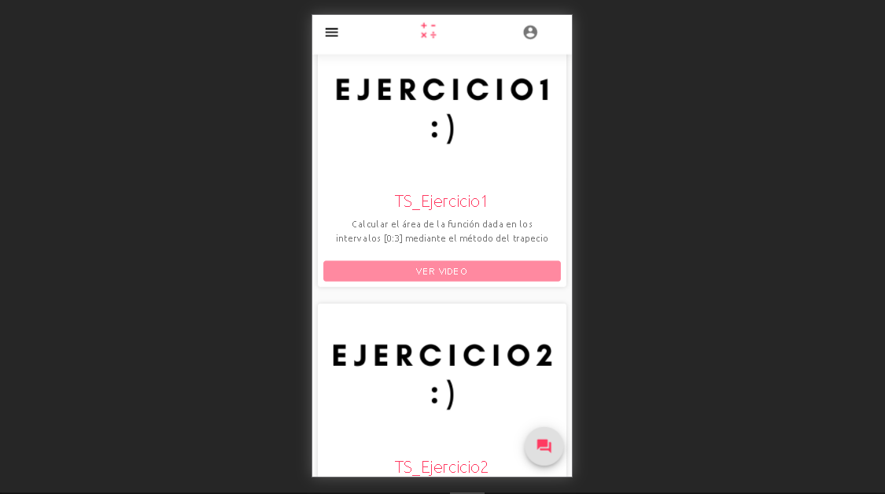

### Interfaz Video Ordenador
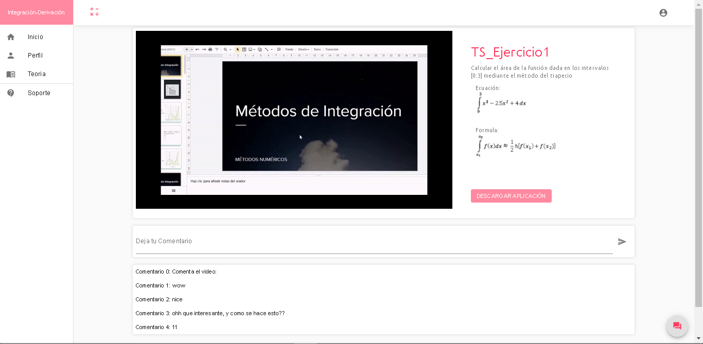

### Interfaz Video Responsive
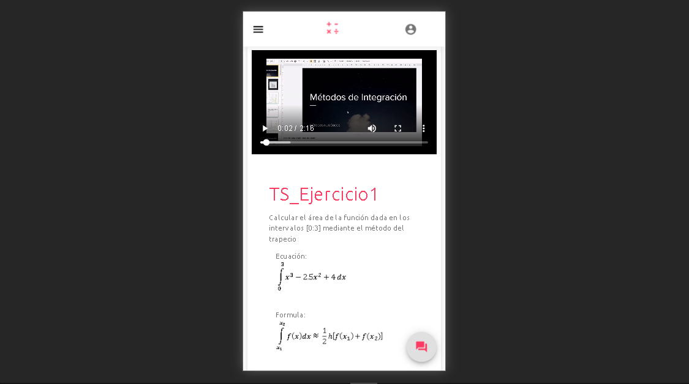

### Interfaz Teoria
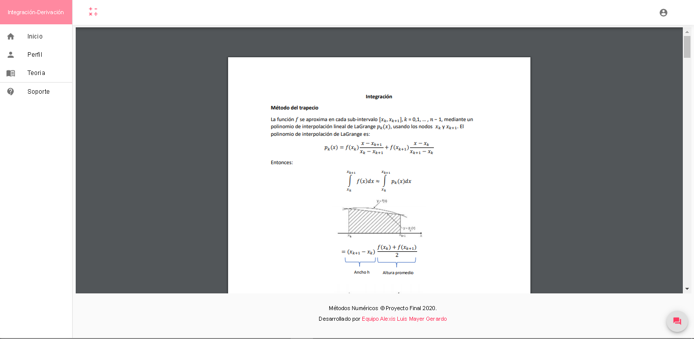

### Interfaz Guia de Instalacion y Manual Plataforma
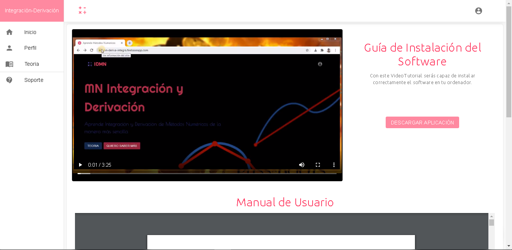

### Interfaz Integrantes del Proyecto
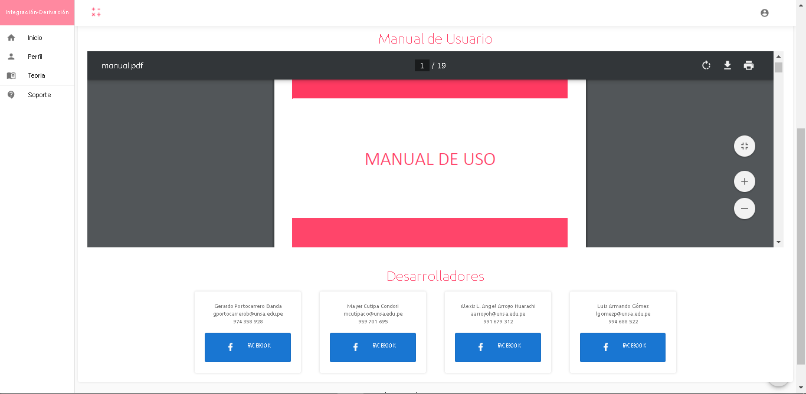

### Interfaz Registro
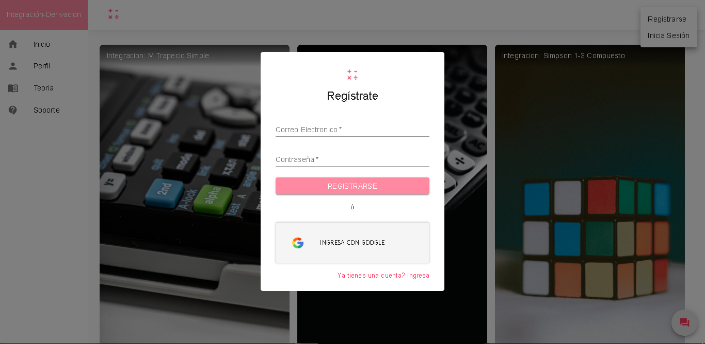

### Interfaz Registro por Google
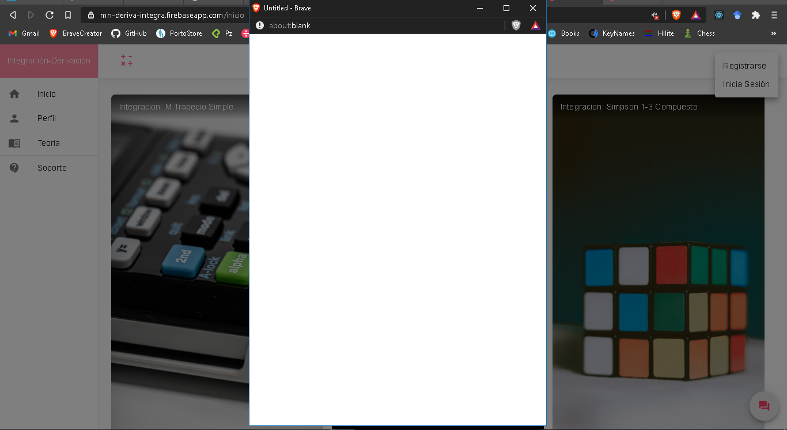

### Interfaz Perfil Ordenador
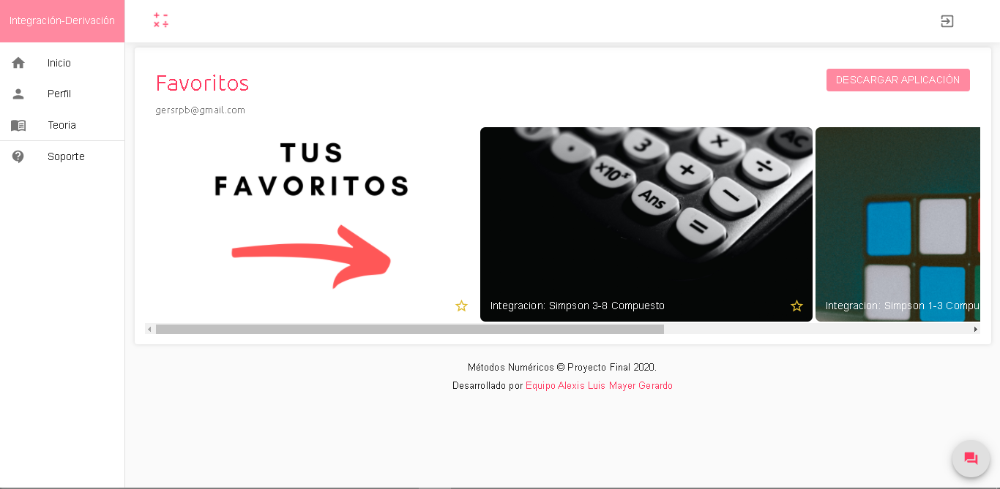

### Interfaz Perfil Responsive
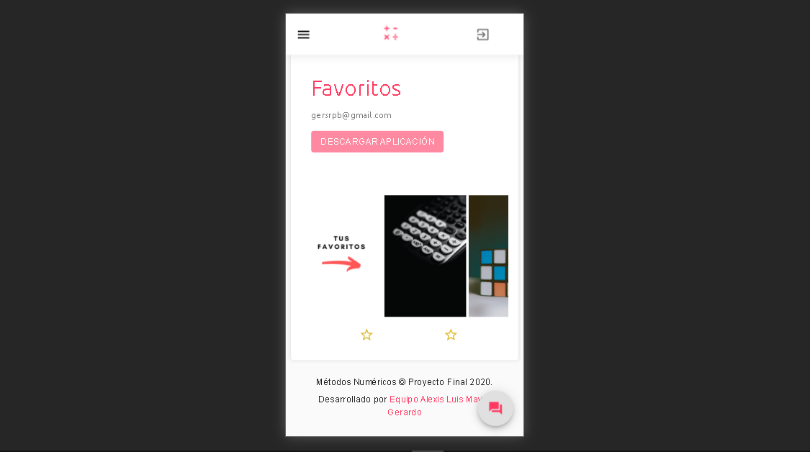

### Interfaz Encuesta
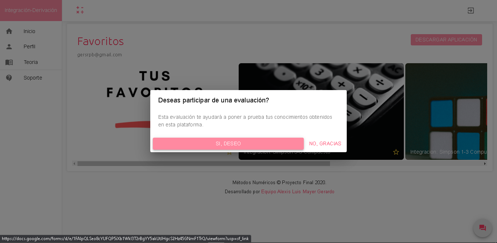

### Evaluacion
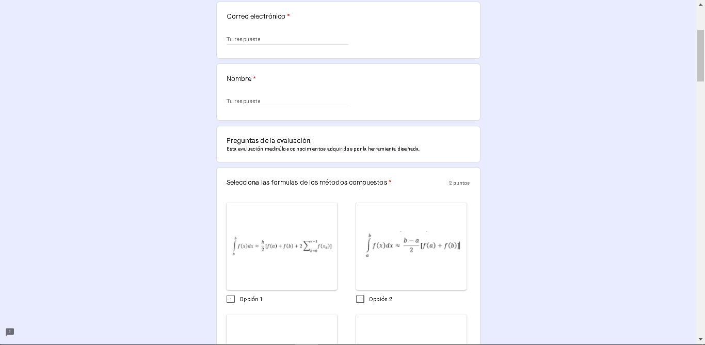